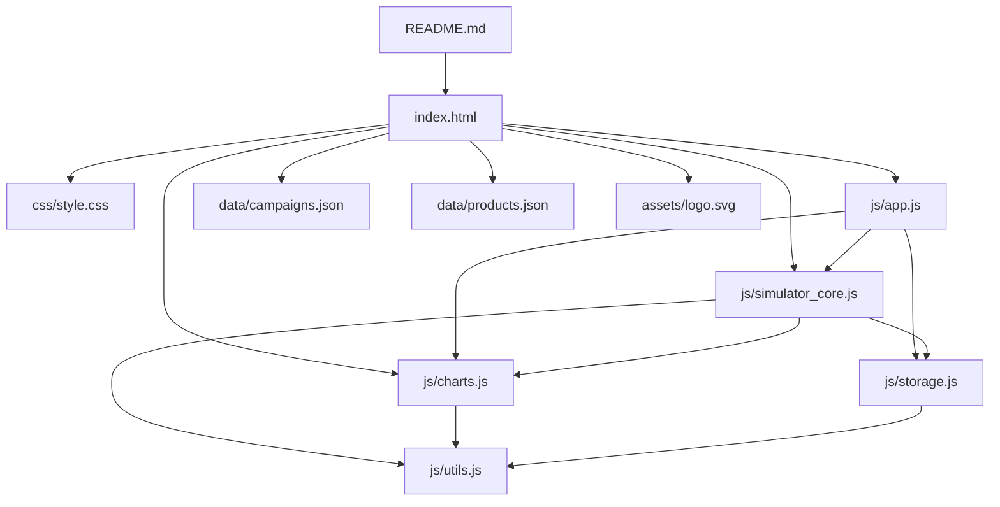

# Amazon-ad-console - Code Dependency Graph

```mermaid
graph TD
    N0["README.md"]
    N1["index.html"]
    N2["css/style.css"]
    N3["js/app.js"]
    N4["js/simulator_core.js"]
    N5["js/charts.js"]
    N6["js/storage.js"]
    N7["js/utils.js"]
    N8["data/campaigns.json"]
    N9["data/products.json"]
    N10["assets/logo.svg"]
    N0 --> N1
    N1 --> N2
    N1 --> N3
    N1 --> N4
    N1 --> N5
    N1 --> N8
    N1 --> N9
    N3 --> N4
    N3 --> N5
    N3 --> N6
    N4 --> N5
    N4 --> N6
    N4 --> N7
    N5 --> N7
    N6 --> N7
    N1 --> N10
```