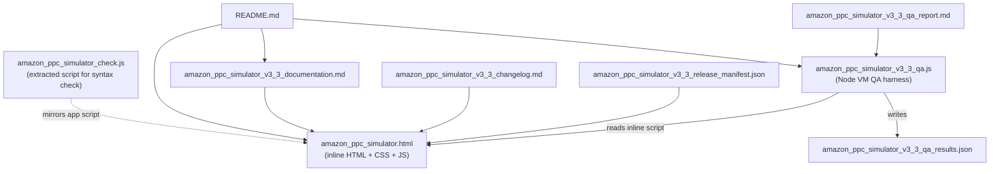

# Amazon-ad-console - Code Dependency Graph

This project is a single-file, offline HTML training simulator. The app and its
inline script live entirely inside `amazon_ppc_simulator.html`. Supporting files
are documentation and a Node-based QA harness.

